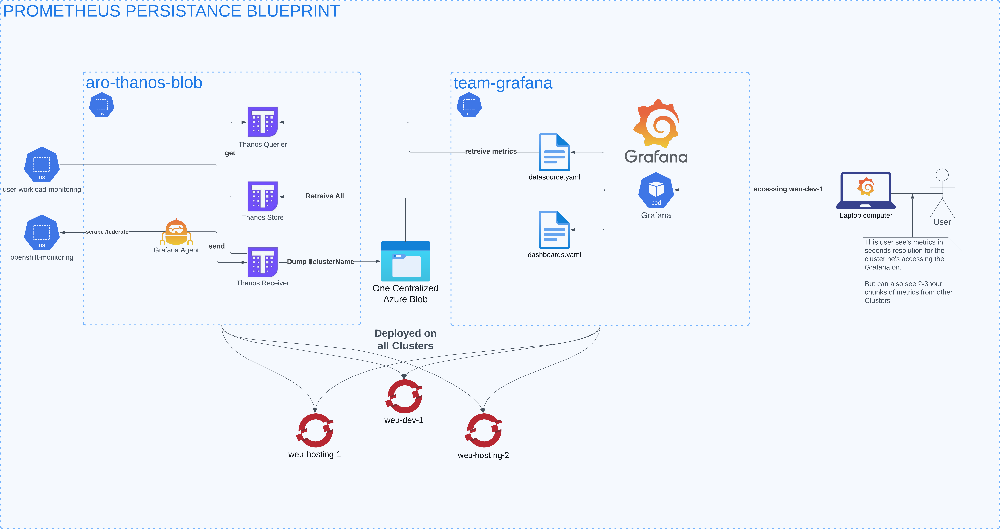

# Connecting ARO Metrics to Azure Blob using Thanos
This project deploys aro-thanos-blob on your cluster. This will help you in persisting and centralizing your ARO Clusters Metrics!

## Getting Started
To deploy the orchestration, have a look at the `components` under `deployment/`. These are all optional, so pick the ones that suit your cluster. Do make sure that you need to handle the metric forwarding yourself if you choose to not use the Patch Operator.

Use the `deployment/overlays` in this Repository as an example, in your own GitOps setup you can reference the base folder in your `kustomization.yaml` like this: `- ssh://git@github.com:Ortec-Finance/aro-thanos-blob//deployment/base?ref=main` and implement your overlays with your custom configuration.

### Connecting the Azure Blob
In `deployment/components/azure-storage` we provide a `SecretStore` and an `ExternalSecret`. In this case it is configured to sync from an Azure Keyvault. The ExternalSecret must synchronize a Secret with these contents:
```
    type: AZURE
    config:
      storage_account: "your_storageaccount_name"
      storage_account_key: "your_key"
      container: "your_cluster_name"
      max_retries: 0
```
This will configure the Thanos Store to persist and retreive metrics from the Azure Blob.
The name of the secret is `aro-thanos-blob-sa-creds`. `sa` in this case stands for Storage Account.


## The Architecture
aro-thanos-blob consists of 4 services.
- Grafana Agent
- Thanos Receiver
- Thanos Store
- Thanos Querier

Each service has a role in the setup to make sure your dashboards and alerts have metrics that you know are safely peristed in an Azure Blob.

Here's an image that shows an overview of the Architecture:


### Retrieving Metrics
The Agent and Receiver ensure that both Cluster Metrics and User Workload metrics are scraped from openshift-monitoring and received from openshift-user-workload-monitoring.

The GitOps in this project patches your openshift-monitoring configuration so that the cluster metrics are forwarded to the Thanos Receiver. We can unfortunately not do the same with user-workload monitoring. So instead we have a Grafana Agent scraping the /federate endpoint and remote_write it to the Thanos Receiver.

### Persisting and Exposing Metrics
Thanos Receiver now has the metrics from both the Cluster and User Workloads. It will proceed to forward the metrics to the Thanos Store, which persists the metrics in the Azure Blob. The Thanos Store is also the gateway to retreive the metrics from the Azure Blob. That leads us to the final service, The Thanos Querier. The Querier is configured to retreive the logs from both Thanos Store and Thanos Receiver.

### Why both the Store and Receiver
The Thanos Store chunks the metrics in the Azure Blob, these chunks are somewhere between 2-4 hours large. This means that if we only retreive the metrics from the Thanos Store, we will only see data that is 0 to 4 hours old. This however works perfectly to look back many months worth of metrics, but not so much for alerts and a live feed of the current state.

The receiver however, will give you the live feed, that's why we combine the two feeds to cover the data of the past, and now.


## Connecting metrics from other Clusters
All metrics will be stored in one Azure Storage, each cluster having its own blob. This allows us to also configure an additional Thanos Store to fetch metrics from other clusters. That's what the connector component is for.

### Getting Started
For the Cluster Metric Connector to work, you must have the aro-thanos-blob deployed on both/all clusters. In the cluster you wish to have metrics in from another cluster, you must define a connector for every other cluster.

For example, if you want metrics from the "Acceptance" cluster inside the "Development" cluster, you must deploy the aro-thanos-blob on both + a connector on the Development cluster.

